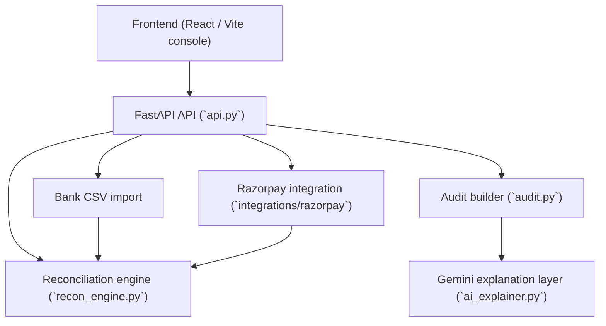

# ReconEngine

Deterministic financial reconciliation for payment operations: orders, settlements, refunds, and bank credits — with a structured audit trail and an optional Gemini explanation layer.

This README is the evaluator-facing overview. Engine internals, CSV schemas, ground-truth policy, and evaluation metrics are documented in [ARCHITECTURE.md](ARCHITECTURE.md).

---

## 1. Problem

Payment operations span several independent records that should describe the same money movement:

| Record | What it represents |
|--------|--------------------|
| **Order / payment** | What the customer paid |
| **Settlement** | What the payment processor says was settled (gross, fees, tax, net) |
| **Refund** | Adjustments that should appear in settlement amounts |
| **Bank transaction** | What actually landed in the merchant bank account |

In practice these sources disagree. Amounts differ, bank rows are missing, settlement rows never arrive, timestamps drift, references are written in slightly different forms, and refunds are not always reflected in gross. Operators need a **repeatable, auditable** decision — not a black-box “match” — so they can explain *why* an order is reconciled or flagged.

---

## 2. Solution

ReconEngine is a **rule-based reconciliation engine** plus a console UI.

1. **Ingest** production-style CSVs (`orders`, `settlements`, `refunds`, `bank`) and/or Razorpay-shaped records.
2. **Normalize** amounts (integer paise), timestamps, and settlement references (deterministic reference rules).
3. **Reconcile** each order through explicit matching rules (order → settlement → bank, plus refund checks).
4. **Detect exceptions** from a finite vocabulary (missing settlement, missing bank, amount mismatch, refund not reflected, and others).
5. **Score** each order with a status from a finite vocabulary and a **confidence score**.
6. **Audit** by transforming the engine result into a structured trail (checks, amounts, references, exceptions, timeline). The audit builder does **not** re-run matching.
7. **Explain** (optional) by sending that structured audit to Gemini as grounded evidence.

**Gemini is an explanation layer only.** It does not decide status, confidence, amounts, or exceptions, and it must not change those facts. Reconciliation remains deterministic in `recon_engine.py`.

---

## 3. Key MVP capabilities

- **CSV bank import** — upload a bank statement and reconcile it against production orders/settlements (`POST /api/v1/reconciliation/import-bank`).
- **Razorpay integration** — read-only sync of Razorpay data, plus a synthetic Razorpay-shaped demo that does **not** call live Razorpay.
- **Reconciliation engine** — deterministic matching, status assignment, and confidence scoring (`recon_engine.py`).
- **Exception detection** — explicit exception types, not free-text errors.
- **Structured audit trail** — display-oriented checks and timeline (`audit.py`).
- **Confidence scoring** — integer score on each order result.
- **Gemini AI explanation** — natural-language explanation of an *existing* audit (`ai_explainer.py`).
- **Deterministic demo scenarios** — `data/demo_bank.csv` (also inlined in the Bank Import UI) for a reliable Saturday walkthrough without waiting on live Razorpay settlements.

---

## 4. Demo scenarios

Use **Bank Import → Load Demo CSV → Run Reconciliation**. The five pinned cards are:

| Order | Scenario | What it demonstrates |
|-------|----------|----------------------|
| **ORD_0001** | Reconciled | Order, settlement, and bank amounts align (happy path). |
| **ORD_0002** | Bank Amount Mismatch | Bank credit exists but does not match settlement net. |
| **ORD_0003** | Missing Bank | Settlement exists; no bank row was imported for that settlement. |
| **ORD_0033** | Refund Adjusted | Refund is correctly reflected; order reconciles with refund adjustment. |
| **ORD_0024** | Missing Settlement | Order has no linked settlement (from the production order set). |

The import still reconciles the full production order set; the cards are the evaluator-facing subset. **Do not depend on a newly created Razorpay test payment settling in time.**

---

## 5. Architecture



`api.py` orchestrates HTTP. Matching rules live only in `recon_engine.py`. Evaluation against `data/ground_truth.json` is a separate path (`metrics.py` / `GET /api/v1/evaluation`) and is **not** used by reconciliation.

---

## 6. Technology stack

Discovered from this repository (not an exhaustive dependency dump):

| Layer | Technologies |
|-------|----------------|
| Backend | Python 3.14, FastAPI, Uvicorn, pandas, httpx, python-dotenv, python-multipart |
| Frontend | React, TypeScript, Vite, Tailwind CSS, React Router, Vitest, Testing Library |
| External APIs | Google Gemini (`generativelanguage.googleapis.com`), Razorpay REST API |
| Tests | pytest, Vitest |

Engine evaluation uses `data/ground_truth.json` only in `metrics.py`. Synthetic datasets are generated by `data_gen.py` with a fixed seed (see ARCHITECTURE.md).

---

## 7. Running locally

The Vite app defaults to **`http://127.0.0.1:8001`**. Start the API on **port 8001**.

**Backend**

```fish
cd ~/Documents/recon_engine
source venv/bin/activate.fish
./venv/bin/uvicorn api:app --reload --port 8001
```

**Frontend**

```fish
cd ~/Documents/recon_engine/frontend
npm run dev
```

Open the marketing landing page (Vite default, typically `http://127.0.0.1:5173`), then **Open ReconEngine**.

Optional: copy `.env.example` → `.env` and `frontend/.env.example` → `frontend/.env`. Override `VITE_API_BASE_URL` only if the API is not on 8001.

---

## 8. Environment configuration

Secrets belong in a **local** `.env` (gitignored). Never commit real keys.

| Variable | Required | Purpose |
|----------|----------|---------|
| `RAZORPAY_KEY_ID` | For live Razorpay sync / checkout | Razorpay Key ID |
| `RAZORPAY_KEY_SECRET` | For live Razorpay sync / signature verify | Razorpay secret (**server only**) |
| `GEMINI_API_KEY` | For Explain with AI | Gemini API key (**server only**) |
| `GEMINI_MODEL` | No | Defaults to `gemini-3.5-flash` |
| `GEMINI_TIMEOUT_SECONDS` | No | Defaults to `45` |
| `RAZORPAY_BASE_URL` | No | Defaults to Razorpay REST v1 |
| `RAZORPAY_TIMEOUT_SECONDS` | No | Defaults to 30 |
| `VITE_API_BASE_URL` | No | Frontend API origin (default `http://127.0.0.1:8001`) |
| `VITE_RAZORPAY_KEY_ID` | For browser Checkout only | Public Key ID only — **never** a secret |

`.env.example` and `frontend/.env.example` are empty placeholders.

---

## 9. Demo walkthrough

Primary path (**deterministic bank CSV**, not live Razorpay settlement):

1. Landing page → **Open ReconEngine**
2. Sidebar **Bank Import** (or Command Center → **Open Bank Import**)
3. **Load Demo CSV**
4. **Run Reconciliation**
5. Open a **demo scenario** card
6. **Pipeline** tab
7. **Audit Trail** tab
8. **Explain with AI** (requires `GEMINI_API_KEY`)

**Primary mismatch demo:** **ORD_0002** (bank amount mismatch).
**Primary success demo:** **ORD_0001** (reconciled).

Command Center “Run reconciliation” refreshes the **production CSV** report; it is not the bank-import demo. After leaving Bank Import, re-run Load Demo CSV + Run Reconciliation if the import results are gone.

---

## 10. API endpoints

| Method | Path | Purpose |
|--------|------|---------|
| `GET` | `/health` | API health |
| `GET` | `/api/v1/reconciliation/report` | Reconcile production CSVs; full report |
| `GET` | `/api/v1/reconciliation/summary` | Summary counts |
| `GET` | `/api/v1/reconciliation/{order_id}/audit` | Structured audit from the production report |
| `GET` | `/api/v1/reconciliation/{order_id}/audit/explain` | Gemini explanation for that production-report audit |
| `POST` | `/api/v1/reconciliation/audit` | Structured audit from a supplied `order_result` (bank-import drawer) |
| `POST` | `/api/v1/reconciliation/audit/explain` | Gemini explanation for that supplied result |
| `POST` | `/api/v1/reconciliation/import-bank` | Multipart bank CSV upload + reconcile |
| `GET` | `/api/v1/evaluation` | Engine metrics vs `ground_truth.json` |
| `POST` | `/api/v1/sources/razorpay/sync` | Live Razorpay fetch + map + reconcile when possible |
| `POST` | `/api/v1/sources/razorpay/reconcile-demo` | Synthetic Razorpay-shaped demo (no live Razorpay) |
| `POST` | `/api/v1/sources/razorpay/verify-payment` | Server-side Checkout signature verify (dev utility) |

Interactive docs: `http://127.0.0.1:8001/docs`.

---

## 11. Testing

```fish
cd ~/Documents/recon_engine
./venv/bin/pytest -q

cd ~/Documents/recon_engine/frontend
npx tsc --noEmit
npm test
npm run build
```

Verified in this submission-readiness pass:

| Check | Result |
|-------|--------|
| Backend pytest | 321 passed |
| Frontend (Vitest) | 75 passed |
| TypeScript (`tsc --noEmit`) | passing |
| Production build (`npm run build`) | passing |

---

## 12. Engineering highlights

- **Deterministic rules** — finite status and exception vocabularies; no LLM in the matching path.
- **Normalized model** — integer paise, explicit timestamp tolerance (24h), reference normalization.
- **Ground-truth independence** — reconciliation must not read `ground_truth.json` (enforced by tests).
- **Structured audit** — a read-only projection of engine output for operators.
- **Confidence scoring** — attached to each order result by the engine.
- **AI separated from recon** — Gemini sees compact audit JSON; it cannot rewrite engine facts.
- **Test coverage** — unit, API, Razorpay adapter, audit, bank import, and frontend UI tests.
- **Deterministic demo data** — `data/demo_bank.csv` for evaluation when live settlement lag would hide the story.

This is an internship **MVP**, not a claim of production readiness (no multi-tenant auth, no hosted deployment contract, no SLA).

---

## 13. Security notes

Verified from the current code and ignore rules:

- Razorpay **secret** and Gemini **API key** are read on the server from the environment. The frontend is not given `RAZORPAY_KEY_SECRET` or `GEMINI_API_KEY`.
- `.env` and `frontend/.env` are listed in `.gitignore`.
- Gemini is called with `key` as a query parameter to Google; that key is not included in ReconEngine JSON responses (explain responses expose `provider` / `model` / explanation text and the **existing** audit facts).
- The explainer prompt is built from structured audit evidence, not from credentials or raw `.env` files.

---

## 14. Known limitations

- **Live Razorpay settlements are not instant.** A Checkout test payment may not have a settlement (or bank credit) in time for a demo. That is processor timing, not an engine defect. Use **Bank Import + demo CSV** for a reliable walkthrough.
- Razorpay **does not provide bank statement rows**. Sync can leave bank-side gaps by design; the UI states this.
- `GET .../audit` and `GET .../audit/explain` always use the **production CSV report**. After a bank import, the drawer uses **POST** `/audit` and `/audit/explain` with the imported `order_result` so Pipeline and Audit stay aligned.
- Gemini requires `GEMINI_API_KEY`. Without it, Explain with AI returns an availability error; reconciliation still works.
- Default model is **`gemini-3.5-flash`**. `gemini-3.6-flash` is listed by Google but was observed to stall on this API surface.

---

## 15. Project structure

```
recon_engine/
├── api.py                 # FastAPI surface
├── recon_engine.py        # Matching, status, confidence
├── audit.py               # Structured audit (read-only)
├── ai_explainer.py        # Gemini REST client
├── metrics.py             # Evaluation vs ground truth
├── data_gen.py            # Seeded synthetic CSVs + ground_truth
├── ARCHITECTURE.md        # Engine / dataset / evaluation detail
├── data/
│   ├── orders.csv, settlements.csv, refunds.csv, bank.csv
│   ├── demo_bank.csv      # Evaluator demo bank file
│   └── ground_truth.json  # Evaluation only
├── integrations/razorpay/ # Read-only client, sync, demo fixtures
├── frontend/              # Vite + React console
└── tests/                 # pytest
```
